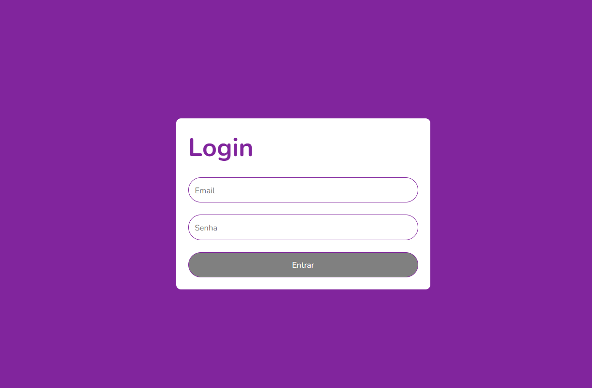

<h1 align="center"> React Validated Login</h1>

  Voce pode encontrar demo do projeto no github pages nesse <a href="https://lupebreak.github.io/react-validated-login-desafio-4/">Link</a>

  <a href="#-tecnologias">Tecnologias</a>&nbsp;&nbsp;&nbsp;|&nbsp;&nbsp;&nbsp;
  <a href="#-projeto">Projeto</a>&nbsp;&nbsp;&nbsp;|&nbsp;&nbsp;&nbsp;
  <a href="#memo-licença">Licença</a>

  

 

  

## 🚀 Tecnologias

Esse projeto foi desenvolvido com as seguintes tecnologias:

- Typescript
- React
- React Hook Forms
- yup
- Git e Github

## 💻 Projeto

React Validated Login é uma pagina com um formulario de login que possui controle e validaçoes utilizando react-hook-forms e yup;

## :memo: Licença

Esse projeto está sob a licença MIT.

---

Feito com ♥ by [LuPeBreak](https://github.com/LuPeBreak/) como um LabProject dos cursos de React da [DIO](https://dio.me/) durante o Bootcamp da Orange Tech
